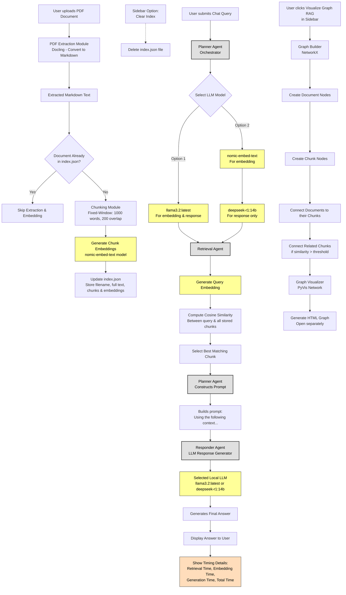

# Multi-Agent AI RAG Bot

A local-first, multi-agent AI system that uses Retrieval-Augmented Generation (RAG) techniques to answer questions based on your own documents. This repository demonstrates how multiple specialized agents can work together—one for retrieval, another for response generation, a planner to orchestrate them, and an optional agent for semantic chunking.

---

## Table of Contents
- [Overview](#overview)
- [Features](#features)
- [Architecture](#architecture)
- [Folder Structure](#folder-structure)
- [Models & Dependencies](#models--dependencies)
- [Ollama Usage](#ollama-usage)
- [How It Works](#how-it-works)
- [License](#license)

---

## Overview

In typical RAG systems, you have a single pipeline:
1. Ingest documents
2. Embed them
3. Retrieve relevant chunks
4. Generate a final answer

Here, we go a step further and assign each responsibility to a specialized agent. These agents are coordinated by a **PlannerAgent**, creating a more modular, extensible system that can be adapted or expanded for additional tasks like semantic chunking, document classification, or advanced analytics.

---

## Features

1. **Multi-Agent Orchestration**  
   - **PlannerAgent**: High-level controller that orchestrates other agents.  
   - **RetrievalAgent**: Fetches the most relevant chunks from a local index.  
   - **ResponderAgent**: Crafts the final response via an LLM.  
   - *(Optional)* **SemanticChunkAgent**: Performs semantic chunking to improve chunk coherence.

2. **Local Embeddings & LLM**  
   - The system uses local embeddings for document indexing (e.g., [nomic-embed-text](https://github.com/nomic-ai/nomic) or others).
   - Local LLM inference via [Ollama](https://github.com/jmorganca/ollama) to ensure data privacy.

3. **Flexible Document Ingestion**  
   - Supports uploading PDF files (converted to Markdown).
   - Optionally allows for advanced chunking (semantic or fixed-window).

4. **RAG Graph Visualization**  
   - You can visualize your indexed documents as a graph. This helps to see how documents (and optionally their chunks) are connected by semantic similarity.

5. **Agentic Framework**  
   - Each agent is purpose-built for a specific task. The code is cleanly separated, allowing easy replacement or extension of any agent.

---

## Architecture

User -> [PlannerAgent] -> [RetrievalAgent] -> [Local Index + Embeddings] | v [ResponderAgent] -> [Local LLM via Ollama]

- **PlannerAgent** decides which agent to call first (usually retrieval), then hands context + user query to the responder for final answer.
- **RetrievalAgent** reads `index.json` to find the most relevant chunk(s).
- **ResponderAgent** calls the local LLM (through Ollama) with the retrieved chunk(s) and user’s question.

*(Optional)* **SemanticChunkAgent** is used during document ingestion to produce more contextually consistent chunks. (potential enhancements)

---

## Folder-Structure

---

## Models & Dependencies

1. **Embedding Model**  
   - Default: [nomic-embed-text](https://github.com/nomic-ai/nomic) or any locally supported embedding model.  
   - Produces vector embeddings for each chunk.

2. **LLM Model**  
   - Default: `llama3.2:latest` (approx. 3B parameters) or `deepseek-r1:14b` for more advanced completions.
   - Managed locally via Ollama.

3. **Python Dependencies**  
   - `streamlit` for the UI  
   - `networkx` + `pyvis` for graph building & visualization  
   - Optional: `spacy` or other NLP libraries for semantic chunking (potential enhancements)

---

## Ollama Usage

This project uses [Ollama](https://github.com/jmorganca/ollama) to run LLM inference locally. Key points:

- **Proxy Endpoint**: By default, the code expects Ollama to run at `http://127.0.0.1:11434`.  
- **Completions**: Sent to `/v1/completions` with JSON payload specifying `model`, `prompt`, `temperature`, etc.  
- **Embeddings**: Sent to `/api/embeddings` for vector generation if the selected model supports it (e.g., `nomic-embed-text`).  

Be sure to have Ollama installed, and the relevant models pulled locally (via `ollama pull <model>`).

---

## How It Works

1. **Document Upload**  
   - PDF is converted to Markdown via `pdf_utils`.
   - *(Optional)* The `SemanticChunkAgent` can produce chunked text based on paragraph/sentence boundaries.

2. **Embedding**  
   - Each chunk is embedded using a local embedding model (like `nomic-embed-text`) and stored in `index.json`.

3. **User Query**  
   - The `PlannerAgent` receives the user query.
   - It calls `RetrievalAgent` to find the chunk with the highest similarity to the query.
   - The chunk is then handed to `ResponderAgent`, which forms a prompt for the local LLM.
   - The local LLM generates a final answer.

4. **Result**  
   - The user sees the final answer in the Streamlit UI, along with optional timing breakdown or conversation history.

---

## License

This repository is provided under the MIT License, so feel free to adapt or integrate it into your own projects. Happy hacking, and enjoy building local multi-agent AI systems with RAG!

