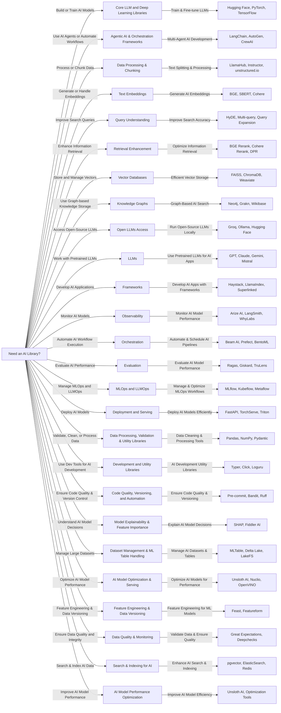

# 🚀 Comprehensive Developer Stack (Python Libraries) for Agentic AI, LLMs, RAG, MLOps, and LLMOps

Welcome to the **Comprehensive AI, LLM, RAG, MLOps & LLMOps Library Index**! 🚀  

This repository is designed to serve as a **one-stop resource** for developers, researchers, and engineers working on **Agentic AI, LLMs, Retrieval-Augmented Generation (RAG), AI Orchestration, Model Deployment, and MLOps.**  

Here, you will find **150+ carefully curated developer stack / Python libraries**, categorized systematically to help you:  

✅ Build, fine-tune, and deploy LLMs efficiently.  
✅ Enhance AI-powered search and retrieval (RAG).  
✅ Implement AI agent frameworks for automation.  
✅ Optimize AI inference and training pipelines.  
✅ Monitor, evaluate, and track AI models in production.  

Each library entry includes a **description, category, GitHub or PyPI link, and unique practical tips** to help you make informed choices when integrating them into your AI projects.  

---

## 📖 Table of Contents  

1 **Core LLM & Deep Learning Libraries**  
2 **Agentic AI & Orchestration Frameworks**  
3 **Retrieval-Augmented Generation (RAG)**  
4 **Vector Databases & Knowledge Graphs**  
5 **Open LLMs Access & Closed LLMs**  
6 **Frameworks for AI Development**  
7 **Observability & Model Monitoring**  
8 **Orchestration & Workflow Automation**  
9 **AI Model Evaluation & Performance Testing**  
10 **MLOps & LLMOps**  
11 **Deployment & Model Serving**  
12 **Data Processing, Validation & Utility Libraries**  
13 **Development & Code Quality Tools**  
14 **Search, Indexing & Vector Retrieval**  
15 **Feature Engineering, Data Versioning & Optimization**  

Jump directly to any section to explore the tools best suited for your **AI & ML workflows.** 🎯  

---

## 📚 Core LLM and Deep Learning Libraries

| S.No | Python Library | Category | Description | GitHub/PyPI Link | Practical Tips |
|------|--------------------------|------------|----------------------------------------|-------------------------------------------------|-----------------------------|
| 1 | Hugging Face Transformers | LLM | NLP models including GPT, BERT, T5 | [GitHub](https://github.com/huggingface/transformers) | Pipeline API for rapid prototyping |
| 2 | PyTorch | LLM | Deep learning framework | [GitHub](https://github.com/pytorch/pytorch) | Ideal for research flexibility |
| 3 | TensorFlow | LLM | Deep learning for production | [GitHub](https://github.com/tensorflow/tensorflow) | Use TensorFlow Extended for scalability |
| 4 | Keras | LLM | High-level neural networks API | [GitHub](https://github.com/keras-team/keras) | Quick prototyping and experimentation |
| 5 | JAX | LLM | Numerical computing with auto-differentiation | [GitHub](https://github.com/google/jax) | Suitable for scalable computation tasks |
| 6 | DeepSpeed | LLM | Distributed training optimization | [GitHub](https://github.com/microsoft/DeepSpeed) | Accelerates large model training |
| 7 | Megatron-LM | LLM | NVIDIA large transformer training | [GitHub](https://github.com/NVIDIA/Megatron-LM) | Efficient for GPU utilization |
| 8 | Colossal-AI | LLM | Scalable distributed AI training | [GitHub](https://github.com/hpcaitech/ColossalAI) | Optimizes resource allocation |
| 9 | BMTrain | LLM | Large-scale ML training toolkit | [GitHub](https://github.com/OpenBMB/BMTrain) | Simple APIs for scalability |
| 10 | Ollama | LLM | Local deployment of LLMs | [GitHub](https://github.com/ollama/ollama) | Quick setup for local inference |
| 11 | vLLM | LLM | High-throughput inference serving | [GitHub](https://github.com/vllm-project/vllm) | Accelerate inference workloads |
| 12 | CTranslate2 | LLM | Fast Transformer model inference | [GitHub](https://github.com/OpenNMT/CTranslate2) | Optimized inference speed |
| 13 | Faster Whisper | LLM | Whisper model inference optimization | [GitHub](https://github.com/guillaumekln/faster-whisper) | Accelerated Whisper inference |
| 14 | TensorRT-LLM | LLM | NVIDIA GPU inference acceleration | [GitHub](https://github.com/NVIDIA/TensorRT) | High performance on NVIDIA GPUs |
| 15 | text-generation-inference | LLM | Text generation toolkit | [GitHub](https://github.com/huggingface/text-generation-inference) | Optimized for fast text outputs |
| 16 | tokenizers | LLM | Text preprocessing toolkit | [GitHub](https://github.com/huggingface/tokenizers) | Essential for preprocessing efficiency |

## 🤖 Agentic AI & Orchestration Frameworks

| S.No | Python Library | Category | Description | GitHub/PyPI Link | Practical Tips |
|------|--------------------------|------------|----------------------------------------|-------------------------------------------------|-----------------------------|
| 17 | LangChain | Agentic AI | Framework for chaining AI agents | [GitHub](https://github.com/langchain-ai/langchain) | Excellent for complex workflows |
| 18 | AutoGen | Agentic AI | Automating agent collaboration | [GitHub](https://github.com/microsoft/autogen) | Simplifies multi-agent systems |
| 19 | CrewAI | Agentic AI | Collaborative agent framework | [GitHub](https://github.com/joaomdmoura/crewAI) | Ideal for collaborative workflows |
| 20 | Flowise | Agentic AI | Drag-and-drop LLM workflows | [GitHub](https://github.com/FlowiseAI/Flowise) | User-friendly workflow creation |
| 21 | NeuML TxtAI | Agentic AI | Semantic search and embeddings | [GitHub](https://github.com/neuml/txtai) | Lightweight text-based AI |
| 22 | Beam AI | Orchestration | Serverless AI pipeline orchestration | [GitHub](https://github.com/slai-labs/beam) | Serverless simplicity |
| 23 | Modal | Orchestration | Cloud-based workflow automation | [GitHub](https://github.com/modal-labs/modal-examples) | Easily scalable cloud automation |
| 24 | Prefect Marvin | Orchestration | AI-assisted workflow orchestration | [GitHub](https://github.com/PrefectHQ/prefect-marvin) | Efficient for intelligent workflows |
| 25 | NeuML TxtAI | Agentic AI | Semantic search and embeddings | [GitHub](https://github.com/neuml/txtai) | Great for lightweight semantic applications |
| 26 | Beam AI | Orchestration | Serverless AI orchestration | [GitHub](https://github.com/slai-labs/beam) | Simplifies serverless deployments |
| 27 | Modal | Orchestration | Cloud-based workflow orchestration | [GitHub](https://github.com/modal-labs/modal-examples) | Scalable cloud deployments |
| 28 | Prefect Marvin | Orchestration | Intelligent workflow orchestration | [GitHub](https://github.com/PrefectHQ/prefect-marvin) | Facilitates AI-assisted workflows |

Let's clearly and directly continue from library number **29** onwards, exactly following your structured table format:

## 🔪 Data Processing & Chunking

| S.No | Python Library     | Category           | Description                                            | GitHub/PyPI Link                                                        | Practical Tips                          |
|------|-------------------|---------------|------------------------------------------------|---------------------------------------------------------------|-----------------------------------------|
| 29   | Crawl4AI          | Extraction    | Web data extraction for structured data       | [GitHub](https://github.com/Crawl4AI/Crawl4AI)                          | Efficient structured data scraping      |
| 30   | FireCrawl         | Extraction    | High-speed web crawling tool                  | [GitHub](https://github.com/mendableai/firecrawl)                       | Excellent for scalable data collection  |
| 30   | ScrapeGraph AI    | Extraction    | AI-powered web scraping automation            | [GitHub](https://github.com/VinciGit00/Scrapegraph-ai)       | Automates complex scraping tasks        |
| 31   | Docling           | Extraction    | Structured document extraction                | [GitHub](https://github.com/doclingjs/docling)               | Useful for structured document parsing  |
| 32   | Lama Parse        | Extraction    | Efficient document parsing                    | [GitHub](https://github.com/llamahub-ai/llama-parse)         | Easy PDF parsing                        |
| 32   | MegaParser        | Extraction    | Large-scale document parser                   | [GitHub](https://github.com/megaparser/megaparser)           | Handles large, complex documents        |
| 32   | ExtractThinker    | Extraction    | Intelligent document data extraction          | [GitHub](https://github.com/ExtractThinker/ExtractThinker)   | Advanced extraction logic               |
| 33   | Instructor        | Chunking      | Intelligent text splitting and chunking       | [GitHub](https://github.com/instructor-embedding/instructor-embedding) | Improves RAG retrieval                  |
| 33   | Lama Parse        | Extraction    | PDF and document parsing library              | [GitHub](https://github.com/lama-parse/lama-parse)           | Efficient for document-heavy projects   |
| 33   | LlamaHub          | Data Processing| Connectors for data integration               | [GitHub](https://github.com/run-llama/llama-hub)             | Easy data integrations with LLM apps    |
| 34   | unstructured.io   | Data Processing| Processes unstructured documents              | [GitHub](https://github.com/Unstructured-IO/unstructured)    | Robust handling of unstructured data    |

## 🔠 Text Embeddings

| S.No | Python Library | Category | Description | GitHub/PyPI Link | Practical Tips |
|------|----------------|----------|-------------|------------------|----------------|
| 35 | BGE | Embeddings | High-performance embeddings for semantic search | [GitHub](https://github.com/FlagOpen/FlagEmbedding) | Excellent for semantic similarity |
| 36 | SBERT | Embeddings | Sentence-transformers for semantic search | [GitHub](https://github.com/UKPLab/sentence-transformers) | Best for sentence-level embeddings |
| 37 | Nomic | Embeddings | Vector search and embeddings management | [GitHub](https://github.com/nomic-ai/nomic) | Scalable embedding management |
| 38 | Ollama | Embeddings | Local model embeddings generation | [GitHub](https://github.com/ollama/ollama) | Quick local embedding setup |
| 39 | Cohere | Embeddings | API-based embeddings and NLP tasks | [GitHub](https://github.com/cohere-ai/cohere-python) | Easy API integration |
| 40 | OpenAI | Embeddings | Embedding API from OpenAI | [GitHub](https://github.com/openai/openai-python) | Reliable embeddings from GPT models |
| 41 | VoyageAI | Embeddings | High-quality embedding service | [GitHub](https://github.com/voyageai/voyageai-python) | Great alternative embeddings |

## 🔍 Query Understanding  

| S.No | Python Library | Category | Description | GitHub/PyPI Link | Practical Tips |
|------|----------------|----------|-------------|------------------|----------------|
| 42 | HyDE | Query Understanding | Enhances queries for better retrieval | [GitHub](https://github.com/texttron/hyde) | Use to clarify ambiguous queries |
| 43 | Multi-query | Query Understanding | Generates multiple queries for improved retrieval | [GitHub](https://github.com/langchain-ai/langchain/blob/master/libs/langchain/langchain/retrievers/multi_query.py) | Improves recall and precision |
| 44 | Query Expansion | Query Understanding | Expands user queries to enhance document retrieval | [GitHub](https://github.com/castorini/pyserini) | Ideal for increasing search coverage |

## 🔃 Retrieval Enhancement  

| S.No | Python Library | Category | Description | GitHub/PyPI Link | Practical Tips |
|------|-----------------|----------|-------------|------------------|----------------|
| 45 | BGE Rerank | Re-ranking | Re-ranks retrieved documents to enhance relevance | [GitHub](https://github.com/FlagOpen/FlagEmbedding) | Ideal for improving top-k results |
| 46 | Cohere Rerank | Re-ranking | Cohere's re-ranking service for better retrieval | [GitHub](https://github.com/cohere-ai/cohere-python) | Easy integration with APIs |
| 47 | DPR | Hybrid Search | Dense Passage Retrieval for effective retrieval | [GitHub](https://github.com/facebookresearch/DPR) | Use in dense retrieval setups |
| 48 | ColBERT | Hybrid Search | Hybrid retrieval combining sparse and dense searches | [GitHub](https://github.com/stanford-futuredata/ColBERT) | Excellent for precision improvement |
| 49 | Superlinked | Semantic Space | Unified semantic search and retrieval | [GitHub](https://github.com/superlinkedhq/superlinked) | Integrates easily with embeddings |

## 🔢 Vector Databases  

| S.No | Python Library | Category | Description | GitHub/PyPI Link | Practical Tips |
|------|----------------|----------|-------------|------------------|----------------|
| 50 | Milvus | Vector DB | Scalable vector similarity search | [GitHub](https://github.com/milvus-io/milvus) | Excellent for large datasets |
| 51 | Qdrant | Vector DB | Vector similarity search engine | [GitHub](https://github.com/qdrant/qdrant) | Ideal for fast similarity searches |
| 52 | Weaviate | Vector DB | GraphQL-powered vector database | [GitHub](https://github.com/weaviate/weaviate) | Multi-modal and flexible querying |
| 53 | ChromaDB | Vector DB | Lightweight embedding database | [GitHub](https://github.com/chroma-core/chroma) | Fast setup and prototyping |
| 54 | Pinecone | Vector DB | Managed high-performance vector database | [GitHub](https://github.com/pinecone-io/pinecone-python-client) | Managed service ideal for production |
| 55 | FAISS | Vector DB | Facebook's library for efficient similarity search | [GitHub](https://github.com/facebookresearch/faiss) | Excellent for large-scale indexing |

## 🕸️ Knowledge Graphs  

| S.No | Python Library | Category | Description | GitHub/PyPI Link | Practical Tips |
|------|----------------|----------|-------------|------------------|----------------|
| 56 | Neo4j | Knowledge Graph | Graph database for connected data | [GitHub](https://github.com/neo4j/neo4j) | Ideal for complex relationship queries |
| 57 | Grakn (TypeDB) | Knowledge Graph | Knowledge graph for semantic relationships | [GitHub](https://github.com/vaticle/typedb) | Semantic reasoning and AI integration |
| 58 | Wikibase | Knowledge Graph | Flexible structured data management | [GitHub](https://github.com/wikimedia/Wikibase) | Useful for structured collaborative data |

## 🔌 Open LLMs Access  

| S.No | Python Library | Category | Description | GitHub/PyPI Link | Practical Tips |
|------|--------------|------------|-------------|------------------|----------------|
| 59 | Groq | Open LLM | High-speed inference for LLMs | [GitHub](https://github.com/groq-inc) | Optimized for ultra-low latency |
| 60 | Ollama | Open LLM | Local deployment of LLMs | [GitHub](https://github.com/ollama/ollama) | Easy-to-use for offline LLMs |
| 61 | Together AI | Open LLM | Cloud-hosted LLM inference and fine-tuning | [GitHub](https://github.com/togethercomputer) | Offers cost-effective API access |
| 62 | Hugging Face | Open LLM | Hub for open-source LLMs | [GitHub](https://github.com/huggingface) | Hosts thousands of LLM models |

## 🤖 LLMs  

| S.No | Python Library | Category | Description | GitHub/PyPI Link | Practical Tips |
|------|--------------|------------|-------------|------------------|----------------|
| 63 | Phi-4 | Open LLM | Advanced small-scale transformer model | [GitHub](https://github.com/microsoft/Phi-4) | Optimized for efficiency in reasoning tasks |
| 64 | Mistral | Open LLM | High-quality generative language model | [GitHub](https://github.com/mistralai) | Strong performance for multilingual tasks |
| 65 | Qwen 2.5 | Open LLM | Open-source LLM by Alibaba | [GitHub](https://github.com/QwenLM) | Efficient and robust for chatbot applications |
| 66 | Gemma 2 | Open LLM | Google’s open LLM | [GitHub](https://github.com/google/gemma) | Lightweight and optimized for NLP |
| 67 | Llama 3.3 | Open LLM | Meta’s third-generation LLM | [GitHub](https://github.com/facebookresearch/llama) | Designed for large-scale generative AI tasks |
| 68 | AWS Bedrock | Closed LLM | AWS-hosted LLMs for enterprise AI | [GitHub](https://aws.amazon.com/bedrock/) | Best for enterprise-level applications |
| 69 | Claude | Closed LLM | Anthropic’s safety-focused LLM | [GitHub](https://github.com/anthropics) | Excels in ethical AI responses |
| 70 | Gemini | Closed LLM | Google DeepMind's LLM suite | [GitHub](https://github.com/google/gemini) | Strong in multimodal AI applications |
| 71 | Cohere | Closed LLM | API-based LLM for enterprise applications | [GitHub](https://github.com/cohere-ai) | Fine-tuned for high-quality NLP tasks |
| 72 | OpenAI GPT | Closed LLM | OpenAI’s ChatGPT and API models | [GitHub](https://github.com/openai) | State-of-the-art reasoning and generation |

## 🛠️ Frameworks  

| S.No | Python Library | Category | Description | GitHub/PyPI Link | Practical Tips |
|------|--------------|------------|-------------|------------------|----------------|
| 73 | LangChain | Framework | LLM-based application framework | [GitHub](https://github.com/langchain-ai/langchain) | Best for chaining multiple AI tools |
| 74 | LlamaIndex | Framework | Data indexing for LLM-powered applications | [GitHub](https://github.com/jerryjliu/llama_index) | Efficient document retrieval for RAG |
| 75 | Haystack | Framework | NLP and RAG application development | [GitHub](https://github.com/deepset-ai/haystack) | Suitable for production-ready AI apps |
| 76 | NeuML TxtAI | Framework | Lightweight NLP framework for search and similarity | [GitHub](https://github.com/neuml/txtai) | Ideal for scalable text search |
| 77 | Superlinked | Framework | AI-powered document and knowledge management | [GitHub](https://github.com/superlinkedhq/superlinked) | Great for enterprise knowledge bases |

## 🔭 Observability  

| S.No | Python Library | Category | Description | GitHub/PyPI Link | Practical Tips |
|------|--------------|------------|-------------|------------------|----------------|
| 78 | Arize AI | Observability | ML observability and model monitoring | [GitHub](https://github.com/Arize-ai) | Detect and debug model drift efficiently |
| 79 | WhyLabs | Observability | AI observability and data monitoring | [GitHub](https://github.com/whylabs/whylogs) | Use for real-time ML model monitoring |
| 80 | LangSmith | Observability | LLM observability and evaluation | [GitHub](https://smith.langchain.com/) | Optimized for LangChain-powered applications |

## 🎛 Orchestration  

| S.No | Python Library | Category | Description | GitHub/PyPI Link | Practical Tips |
|------|--------------|------------|-------------|------------------|----------------|
| 81 | Beam AI | Orchestration | Serverless AI pipeline orchestration | [GitHub](https://github.com/slai-labs/beam) | Ideal for handling distributed AI workloads |
| 82 | Modal | Orchestration | Cloud-based AI workflow automation | [GitHub](https://github.com/modal-labs/modal-examples) | Scalable and cost-efficient serverless AI |
| 83 | Prefect | Orchestration | Workflow automation for ML and AI | [GitHub](https://github.com/PrefectHQ/prefect) | Great for automating AI pipelines |
| 84 | Marvin | Orchestration | AI-driven task automation framework | [GitHub](https://github.com/PrefectHQ/prefect-marvin) | Best for LLM-based workflow execution |
| 85 | BentoML | Orchestration | Model serving and deployment framework | [GitHub](https://github.com/bentoml/bentoml) | Simplifies AI model production deployment |

## 📈 Evaluation  

| S.No | Python Library | Category | Description | GitHub/PyPI Link | Practical Tips |
|------|--------------|------------|-------------|------------------|----------------|
| 86 | Ragas | Evaluation | Evaluates RAG system performance | [GitHub](https://github.com/explodinggradients/ragas) | Use to measure retrieval accuracy |
| 87 | Giskard | Evaluation | Automated AI model testing and debugging | [GitHub](https://github.com/Giskard-AI/giskard) | Ideal for detecting AI biases and errors |
| 88 | TruLens | Evaluation | End-to-end LLM application evaluation | [GitHub](https://github.com/truera/trulens) | Provides real-time feedback on LLM interactions |

## ⚙️ MLOps and LLMOps  

| S.No | Python Library | Category | Description | GitHub/PyPI Link | Practical Tips |
|------|--------------|------------|-------------|------------------|----------------|
| 89 | MLflow | MLOps | ML lifecycle tracking and management | [GitHub](https://github.com/mlflow/mlflow) | Best for experiment tracking and model registry |
| 90 | Kubeflow | MLOps | Kubernetes-native AI/ML platform | [GitHub](https://github.com/kubeflow/kubeflow) | Use for scalable cloud ML workflows |
| 91 | Metaflow | MLOps | Data science workflow framework by Netflix | [GitHub](https://github.com/Netflix/metaflow) | Simplifies ML pipelines with built-in versioning |
| 92 | Pachyderm | MLOps | Data versioning and lineage tracking | [GitHub](https://github.com/pachyderm/pachyderm) | Best for tracking large AI datasets |
| 93 | LakeFS | MLOps | Git-like data version control | [GitHub](https://github.com/treeverse/lakeFS) | Ideal for managing AI/ML datasets at scale |
| 94 | Feast | MLOps | Open-source feature store for ML models | [GitHub](https://github.com/feast-dev/feast) | Great for real-time AI/ML feature engineering |
| 95 | Featureform | MLOps | Virtual feature store for ML pipelines | [GitHub](https://github.com/featureform/featureform) | Useful for tracking and managing ML features |
| 96 | Weights & Biases | MLOps | Experiment tracking and visualization | [GitHub](https://github.com/wandb/wandb) | Ideal for large-scale model monitoring |
| 97 | Comet ML | MLOps | AI model tracking and collaboration | [GitHub](https://github.com/comet-ml/comet-examples) | Best for team-based ML experiments |
| 98 | Neptune AI | MLOps | Model metadata and experiment tracking | [GitHub](https://github.com/neptune-ai/neptune) | Use for managing ML metadata efficiently |
| 99 | Deepchecks | MLOps | Continuous validation for ML models and data | [GitHub](https://github.com/deepchecks/deepchecks) | Detect drift and ensure AI reliability |
| 100 | Fiddler AI | MLOps | AI explainability and bias detection | [GitHub](https://github.com/fiddler-labs/fiddler) | Best for debugging and interpreting AI models |

## 🌐 Deployment and Serving  

| S.No | Python Library | Category | Description | GitHub/PyPI Link | Practical Tips |
|------|--------------|------------|-------------|------------------|----------------|
| 101 | FastAPI | Deployment | High-performance API framework for AI applications | [GitHub](https://github.com/tiangolo/fastapi) | Ideal for real-time AI/ML API deployments |
| 102 | Gradio | Deployment | UI framework for ML models | [GitHub](https://github.com/gradio-app/gradio) | Best for creating interactive AI applications |
| 103 | Streamlit | Deployment | No-code web apps for AI models | [GitHub](https://github.com/streamlit/streamlit) | Ideal for AI prototype visualization |
| 104 | TorchServe | Deployment | Serving framework for PyTorch models | [GitHub](https://github.com/pytorch/serve) | Best for large-scale model inference |
| 105 | ONNX Runtime | Deployment | Accelerated inference for AI models | [GitHub](https://github.com/microsoft/onnxruntime) | Optimized for deploying AI models on different platforms |
| 106 | Ray Serve | Deployment | Scalable AI model serving on Ray | [GitHub](https://github.com/ray-project/ray) | Best for distributed inference workloads |
| 107 | Seldon Core | Deployment | Kubernetes-native AI model deployment | [GitHub](https://github.com/SeldonIO/seldon-core) | Ideal for production-ready AI inference |
| 108 | KFServing (KServe) | Deployment | AI model serving on Kubernetes | [GitHub](https://github.com/kserve/kserve) | Best for auto-scaling and multi-model serving |
| 109 | Cortex | Deployment | Serverless AI model deployment | [GitHub](https://github.com/cortexlabs/cortex) | Great for managing AI workloads in the cloud |
| 110 | Merlin | Deployment | AI model serving and recommendation engine | [GitHub](https://github.com/NVIDIA-Merlin) | Best for large-scale recommendation systems |
| 111 | Triton Inference Server | Deployment | NVIDIA’s optimized AI model serving | [GitHub](https://github.com/triton-inference-server/server) | Best for high-throughput AI inference |
| 112 | OpenVINO | Deployment | Intel-optimized AI model inference | [GitHub](https://github.com/openvinotoolkit/openvino) | Best for deploying AI models on edge devices |

## ⚙️ Data Processing, Validation & Utility Libraries  

| S.No | Python Library | Category | Description | GitHub/PyPI Link | Practical Tips |
|------|--------------|------------|-------------|------------------|----------------|
| 113 | Pandas | Data Processing | Data manipulation and analysis library | [GitHub](https://github.com/pandas-dev/pandas) | Essential for structured data handling |
| 114 | NumPy | Data Processing | Numerical computing library | [GitHub](https://github.com/numpy/numpy) | Best for matrix operations in AI |
| 115 | SciPy | Data Processing | Scientific computing toolkit | [GitHub](https://github.com/scipy/scipy) | Ideal for mathematical and statistical operations |
| 116 | Matplotlib | Visualization | Data visualization library | [GitHub](https://github.com/matplotlib/matplotlib) | Use for static plots and graphs |
| 117 | Seaborn | Visualization | Statistical data visualization | [GitHub](https://github.com/mwaskom/seaborn) | Great for quick exploratory data analysis |
| 118 | XGBoost | ML Algorithms | Gradient boosting library for AI models | [GitHub](https://github.com/dmlc/xgboost) | Efficient for structured data ML models |
| 119 | SQLAlchemy | Database | SQL toolkit and Object Relational Mapper | [GitHub](https://github.com/sqlalchemy/sqlalchemy) | Best for integrating AI with databases |
| 120 | Pydantic | Validation | Data validation and settings management | [GitHub](https://github.com/pydantic/pydantic) | Ensures AI inputs are properly formatted |
| 121 | Scrapy | Data Extraction | Web crawling and scraping tool | [GitHub](https://github.com/scrapy/scrapy) | Best for collecting AI training data |
| 122 | Gensim | NLP | Topic modeling and document similarity | [GitHub](https://github.com/RaRe-Technologies/gensim) | Ideal for word embedding tasks |
| 123 | TextBlob | NLP | Easy-to-use text processing library | [GitHub](https://github.com/sloria/TextBlob) | Best for sentiment analysis and NLP tasks |
| 124 | NLTK | NLP | Classical NLP toolkit | [GitHub](https://github.com/nltk/nltk) | Good for traditional text processing tasks |
| 125 | Polyglot | NLP | Multilingual NLP toolkit | [GitHub](https://github.com/aboSamoor/polyglot) | Best for handling multiple languages |
| 126 | Pattern | NLP | Web mining and NLP framework | [GitHub](https://github.com/clips/pattern) | Useful for data retrieval and sentiment analysis |

## 🔧 Development and Utility Libraries  

| S.No | Python Library | Category | Description | GitHub/PyPI Link | Practical Tips |
|------|--------------|------------|-------------|------------------|----------------|
| 127 | OpenAI Python SDK | SDK | API for OpenAI's LLMs | [GitHub](https://github.com/openai/openai-python) | Simplifies integration with GPT models |
| 128 | Anthropic SDK | SDK | API access for Claude LLMs | [GitHub](https://github.com/anthropics) | Best for using Claude safely in production |
| 129 | Hugging Face Tokenizers | NLP | Efficient tokenization library | [GitHub](https://github.com/huggingface/tokenizers) | Use for optimizing LLM tokenization |
| 130 | Typer | CLI | Easy CLI application building | [GitHub](https://github.com/tiangolo/typer) | Great for building AI command-line tools |
| 131 | Click | CLI | Python CLI framework | [GitHub](https://github.com/pallets/click) | Best for structuring command-line apps |
| 132 | Argparse | CLI | Built-in Python CLI parser | [Docs](https://docs.python.org/3/library/argparse.html) | Essential for script-based AI applications |
| 133 | Loguru | Logging | Simplified logging utility | [GitHub](https://github.com/Delgan/loguru) | Use for efficient AI model logging |
| 134 | OmegaConf | Configuration | Hierarchical configuration library | [GitHub](https://github.com/omry/omegaconf) | Great for AI model hyperparameter tuning |
| 135 | Cloudpathlib | Storage | Cloud storage path handling | [GitHub](https://github.com/drivendataorg/cloudpathlib) | Treats cloud storage like local files |
| 136 | Pandera | Validation | Data validation for Pandas | [GitHub](https://github.com/unionai-oss/pandera) | Ensures AI pipeline data consistency |
| 137 | Coverage | Testing | Code coverage measurement | [GitHub](https://github.com/nedbat/coveragepy) | Helps ensure AI pipelines are well-tested |
| 138 | Ruff | Linter | Fast Python linter | [GitHub](https://github.com/charliermarsh/ruff) | Speed-optimized for large AI projects |
| 139 | Bandit | Security | Security linter for Python | [GitHub](https://github.com/PyCQA/bandit) | Detects security issues in AI codebases |
| 140 | Pytest | Testing | Python testing framework | [GitHub](https://github.com/pytest-dev/pytest) | Best for testing AI/ML code effectively |
| 141 | Mypy | Typing | Static type checker for Python | [GitHub](https://github.com/python/mypy) | Use for maintaining type safety in AI apps |

## 🔍 Code Quality, Versioning, and Automation  

| S.No | Python Library | Category | Description | GitHub/PyPI Link | Practical Tips |
|------|--------------|------------|-------------|------------------|----------------|
| 142 | Commitizen | Versioning | Standardizes commit messages | [GitHub](https://github.com/commitizen-tools/commitizen) | Best for maintaining clean commit history |
| 143 | Dependabot | Dependency Management | Automated dependency updates | [GitHub](https://github.com/dependabot) | Helps keep AI dependencies up to date |
| 144 | Pre-commit | Git Hooks | Runs hooks before committing code | [GitHub](https://github.com/pre-commit/pre-commit) | Ensures code quality before pushing changes |
| 145 | Just | Automation | Task runner for Python projects | [GitHub](https://github.com/casey/just) | Great for automating AI pipeline tasks |

## 🔬 Model Explainability & Feature Importance  

| S.No | Python Library | Category | Description | GitHub/PyPI Link | Practical Tips |
|------|--------------|------------|-------------|------------------|----------------|
| 146 | SHAP | Explainability | SHapley Additive Explanations for ML models | [GitHub](https://github.com/slundberg/shap) | Best for feature importance analysis |
| 147 | Plyer | Utility | Cross-platform access to hardware features | [GitHub](https://github.com/kivy/plyer) | Useful for AI apps requiring system notifications |
| 148 | FastChat | Chatbot | Open-source framework for training and serving chat models | [GitHub](https://github.com/lm-sys/FastChat) | Best for multi-turn chatbot interactions |

## 🔬 Model Explainability & Feature Importance  

| S.No | Python Library | Category | Description | GitHub/PyPI Link | Practical Tips |
|------|--------------|------------|-------------|------------------|----------------|
| 146 | SHAP | Explainability | SHapley Additive Explanations for ML models | [GitHub](https://github.com/slundberg/shap) | Best for feature importance analysis |
| 147 | Plyer | Utility | Cross-platform access to hardware features | [GitHub](https://github.com/kivy/plyer) | Useful for AI apps requiring system notifications |
| 148 | FastChat | Chatbot | Open-source framework for training and serving chat models | [GitHub](https://github.com/lm-sys/FastChat) | Best for multi-turn chatbot interactions |

## 🔗 Dataset Management & ML Table Handling  

| S.No | Python Library | Category | Description | GitHub/PyPI Link | Practical Tips |
|------|--------------|------------|-------------|------------------|----------------|
| 149 | MLTable | Dataset Management | Format and library for managing ML datasets | [GitHub](https://github.com/microsoft/MLTable) | Best for handling structured AI datasets efficiently |

## 🚀 AI Model Optimization & Serving  

| S.No | Python Library | Category | Description | GitHub/PyPI Link | Practical Tips |
|------|--------------|------------|-------------|------------------|----------------|
| 150 | Nuclio | Model Serving | High-performance serverless AI model execution | [GitHub](https://github.com/nuclio/nuclio) | Ideal for real-time AI inference workloads |
| 151 | Delta Lake | Data Lake | Reliable and scalable data lake storage | [GitHub](https://github.com/delta-io/delta) | Best for maintaining ML training datasets |
| 152 | Airflow | Orchestration | Workflow automation for ML pipelines | [GitHub](https://github.com/apache/airflow) | Useful for scheduled AI/ML job execution |

## 📂 Feature Engineering & Data Versioning  

| S.No | Python Library | Category | Description | GitHub/PyPI Link | Practical Tips |
|------|--------------|------------|-------------|------------------|----------------|
| 153 | LakeFS | Data Versioning | Git-like version control for data lakes | [GitHub](https://github.com/treeverse/lakeFS) | Best for tracking dataset changes over time |
| 154 | Fiddler AI | Explainability | ML model bias detection and monitoring | [GitHub](https://github.com/fiddler-labs/fiddler) | Helps improve fairness in AI decision-making |

## ✅ Data Quality & Monitoring  

| S.No | Python Library | Category | Description | GitHub/PyPI Link | Practical Tips |
|------|--------------|------------|-------------|------------------|----------------|
| 155 | Great Expectations | Data Validation | Framework for ensuring data quality | [GitHub](https://github.com/great-expectations/great_expectations) | Helps detect data anomalies in AI pipelines |

## 🔍 Search & Indexing for AI  

| S.No | Python Library | Category | Description | GitHub/PyPI Link | Practical Tips |
|------|--------------|------------|-------------|------------------|----------------|
| 156 | pgvector | Vector Search | PostgreSQL extension for vector similarity search | [GitHub](https://github.com/pgvector/pgvector) | Best for integrating vector search in relational databases |
| 157 | ElasticSearch | Search Engine | Scalable full-text search and analytics engine | [GitHub](https://github.com/elastic/elasticsearch) | Ideal for AI-powered search applications |
| 158 | Redis | Vector Search | Redis with vector similarity search capabilities | [GitHub](https://github.com/redis/redis) | Great for low-latency AI-powered search |

## 🎯 AI Model Performance Optimization  

| S.No | Python Library | Category | Description | GitHub/PyPI Link | Practical Tips |
|------|--------------|------------|-------------|------------------|----------------|
| 159 | Unsloth AI | Optimization | LLM fine-tuning and inference acceleration | [GitHub](https://github.com/unslothai/unsloth) | Reduces model latency and improves efficiency |

## 🧠 Decision Tree

## 🤝 Open for Collaboration  

This repository is a **community-driven initiative** aimed at keeping AI developers informed about the latest tools and frameworks in the AI ecosystem.  

🔹 **Found a missing library?** Open a **Pull Request (PR)** or create an **Issue**.  
🔹 **Have insights on optimizing AI workflows?** Share your experiences!  
🔹 **Spotted outdated information?** Let’s keep this up to date together.  

Contributions are welcome from developers, researchers, and AI enthusiasts worldwide. 🌍🚀  

If you found this useful, consider **starring ⭐ the repository** and sharing it with fellow AI builders!  

---

## 🎯 Conclusion  

The **AI ecosystem** is evolving rapidly, and having the right tools can make all the difference in **building scalable, efficient, and innovative AI applications.**  

This curated list of **150+ Python libraries** provides everything from **LLM fine-tuning and inference acceleration to AI workflow automation, data validation, and real-time AI observability.**  

I hope this helps you in your **AI development journey!** 💡🔥  

Happy coding! 🚀👨‍💻👩‍💻  

---

**Let me know if you need any refinements or additions!** 🚀✅

---
